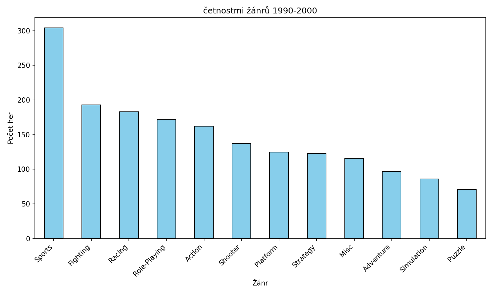
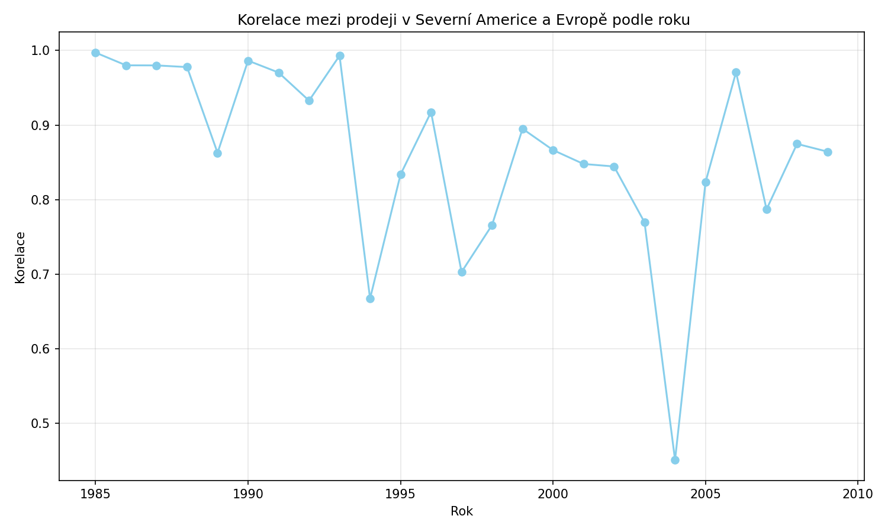
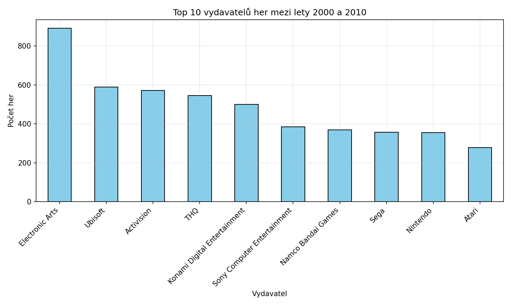
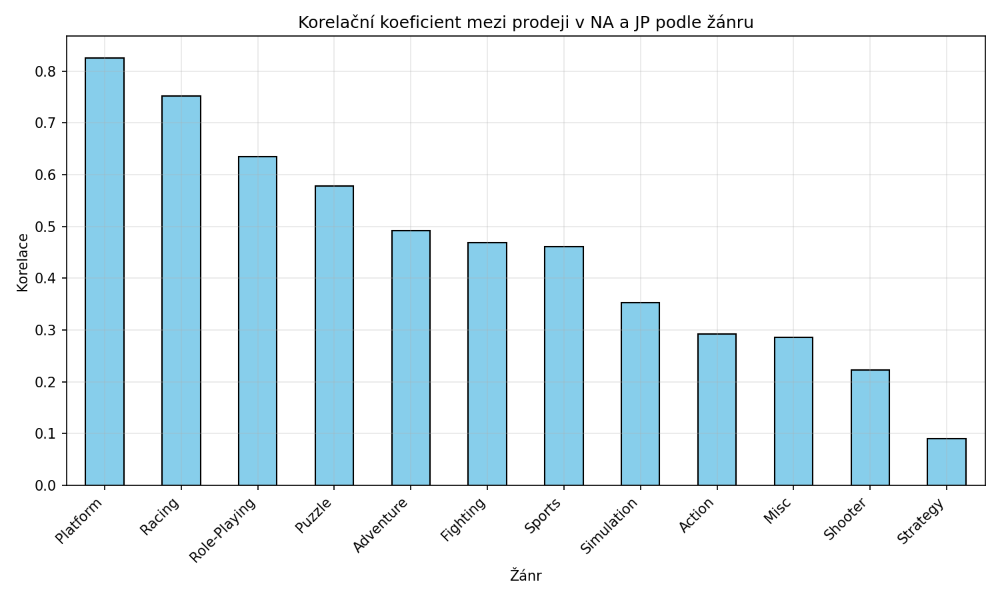

## Úloha 1 – Početnosť žánrov v 90. rokoch

**Zadanie** Zobrazte graf s četnostmi žánrů her mezi lety 1990 (včetně) a 2000 (vyjma).

```python
dfs_90s = df[(df['Year'] >= 1990) & (df['Year'] < 2000)]
genre_counts = dfs_90s['Genre'].value_counts()
```

1. **Filtrovanie:** vyberieme iba riadky, kde je rok vydania od 1990 (vrátane) do 2000 (bez roku 2000). Dve podmienky sa spájajú operátorom `&` a každá musí byť v zátvorkách.
2. **Počítanie:** `value_counts()` spočíta, koľkokrát sa každý žáner v stĺpci `Genre` vyskytuje. Výsledok je zoradený od najčastejšieho žánru.
3. **Graf:** `genre_counts.plot(kind='bar', ...)` vykreslí stĺpcový graf. Popisky osi X sú otočené o 45°, aby sa neprekrývali, a `tight_layout()` upraví okraje tak, aby sa popisky zmestili.



---

## Úloha 2 – Korelácia predajov v Severnej Amerike a Európe

**Zadanie:** Najděte korelační koeficient mezi prodeji v NA a EU. Hodnota: 0.767727

```python
corr = df["NA_Sales"].corr(df["EU_Sales"])
corr_np = np.corrcoef(df["NA_Sales"], df["EU_Sales"])[0, 1]
```

Korelácia sa počíta dvoma spôsobmi, aby sa dali výsledky porovnať:

- **pandas:** `Series.corr()` vráti Pearsonov korelačný koeficient priamo ako jedno číslo.
- **NumPy:** `np.corrcoef()` vráti korelačnú **maticu** 2×2. Na diagonále sú jednotky (korelácia premennej so sebou samou) a mimo diagonály je hľadaná hodnota, preto sa berie prvok `[0, 1]`.

**Výsledok:** obe metódy dávajú rovnakú hodnotu **≈ 0,768**. Ide o silnú kladnú koreláciu: hry, ktoré sa dobre predávajú v Severnej Amerike, sa väčšinou dobre predávajú aj v Európe.

---

## Úloha 3 – Vývoj korelácie podľa rokov

**Zadanie:** Zobrazte v grafu korelační koeficient (NA vs. EU) v jednotlivých letech od roku 1985 po rok 2010.

```python
df_years = df[(df['Year'] >= 1985) & (df['Year'] < 2010)]

yearly_corr = df_years.groupby('Year').apply(
    lambda g: g['NA_Sales'].corr(g['EU_Sales'])
)
```

1. **Filtrovanie:** ponecháme hry vydané od roku 1985 do roku 2009.
2. **Zoskupenie:** `groupby('Year')` rozdelí dáta na skupiny, jednu pre každý rok.
3. **Výpočet pre každú skupinu:** `apply` s funkciou `lambda` spočíta koreláciu `NA_Sales` a `EU_Sales` zvlášť pre každý rok. Výsledkom je Series, kde index je rok a hodnota je korelácia.
4. **Graf:** čiarový graf s bodmi (`marker='o'`) ukazuje, ako sa korelácia v čase mení. Mriežka (`grid`) uľahčuje odčítanie hodnôt.



---

## Úloha 4 – Rozdiel predajov športových hier (NA − EU)

**Zadanie:** Jaké jsou základní statistické údaje rozdílu v prodejích NA a EU pro žánr "Sports", u minima a maxima zjistěte o jaké hry se jedná - minimum (-4.95, FIFA 16), maximum (12.47, Wii Sports), průměr (0.130648), směrodatná odchylka (0.548157).

```python
sports = df[df['Genre'] == 'Sports'].copy()
sports['Diff'] = sports['NA_Sales'] - sports['EU_Sales']
```

1. **Filtrovanie:** vyberieme iba športové hry. `.copy()` vytvorí samostatnú kópiu, aby pandas pri pridaní nového stĺpca nevypisoval varovanie `SettingWithCopyWarning`.
2. **Nový stĺpec `Diff`:** kladná hodnota znamená, že hra sa viac predávala v Severnej Amerike, záporná znamená, že sa viac predávala v Európe.
3. **Základné štatistiky:** `describe()` vypíše počet, priemer, smerodajnú odchýlku, minimum, kvartily (25 %, 50 %, 75 %) a maximum.
4. **Extrémy:** `idxmin()` a `idxmax()` vrátia index riadku s najmenším a najväčším rozdielom. Cez `loc` z neho vytiahneme názov hry a rok.
5. **Priemer a smerodajná odchýlka** sa vypíšu ešte raz samostatne, zaokrúhlené na 3 desatinné miesta.

**Výsledky:**

| Ukazovateľ             | Hodnota                                   |
|------------------------|-------------------------------------------|
| Počet športových hier  | 2 346                                     |
| Priemerný rozdiel      | 0,131 mil.                                |
| Smerodajná odchýlka    | 0,548 mil.                                |
| Minimum                | −4,95 mil. – *FIFA 16* (2015)             |
| Maximum                | 12,47 mil. – *Wii Sports* (2006)          |

Športové hry sa teda v priemere predávajú o niečo lepšie v Severnej Amerike. Najväčšiu prevahu v Európe má *FIFA 16*, čo zodpovedá popularite futbalu v Európe.

---

## Úloha 5 (5.1, 5.2, 5.3)

### 5.1 – Top 10 vydavateľov (2000–2009)

**Zadanie:** Zobrazte graf 10 vydavatelů s nejvíce vydanými hrami mezi lety 2000 (včetně) a 2010 (vyjma).



### 5.2 – Korelácia predajov NA a JP podľa žánru

**Zadanie:** Zobrazte v grafu korelační koeficient mezi prodeji v NA a JP pro jednotlivé žánry.



### 5.3 – Rozdiel predajov RPG hier (JP − NA)

**Zadanie:** Jaké jsou základní statistické údaje rozdílu v prodejích JP a NA pro žánr "Role-Playing"? U minima a maxima zjistěte, o jaké hry se jedná.

```python
rpg = df[df['Genre'] == 'Role-Playing'].copy()
rpg['Diff'] = rpg['JP_Sales'] - rpg['NA_Sales']
```

1. **Filtrovanie:** vyberieme iba hry žánru *Role-Playing*, opäť s `.copy()`, rovnako ako v úlohe 4.
2. **Nový stĺpec `Diff`:** kladná hodnota znamená, že hra sa viac predávala v Japonsku, záporná znamená, že sa viac predávala v Severnej Amerike.
3. **Základné štatistiky:** `describe()` vypíše počet, priemer, smerodajnú odchýlku, minimum, kvartily a maximum.
4. **Extrémy:** `idxmin()` a `idxmax()` nájdu riadky s najmenším a najväčším rozdielom a cez `loc` z nich vytiahneme názov hry a rok.

**Výstup v konzole:**

```text
Uloha 5.3
count    1488.000000
mean        0.016821
std         0.564996
min        -4.930000
25%        -0.080000
50%         0.010000
75%         0.100000
max         4.870000
Name: Diff, dtype: float64

 Minimum: -4.930000000000001, Hra: The Elder Scrolls V: Skyrim, Rok: 2011
Maximum: 4.87, Hra: Monster Hunter Freedom 3, Rok: 2010

 Průměrný rozdíl: 0.017
Směrodatná odchylka rozdílu: 0.565
```

**Výsledky:**

| Ukazovateľ             | Hodnota                                          |
|------------------------|--------------------------------------------------|
| Počet RPG hier         | 1 488                                            |
| Priemerný rozdiel      | 0,017 mil.                                       |
| Smerodajná odchýlka    | 0,565 mil.                                       |
| Minimum                | −4,93 mil. – *The Elder Scrolls V: Skyrim* (2011) |
| Maximum                | 4,87 mil. – *Monster Hunter Freedom 3* (2010)    |

Priemerný rozdiel je takmer nulový, takže RPG hry sa v Japonsku a v Severnej Amerike predávajú v priemere podobne. Extrémy sú však veľké: západné RPG ako *Skyrim* sa predávajú hlavne v Severnej Amerike, kým japonské tituly ako *Monster Hunter* dominujú v Japonsku.
